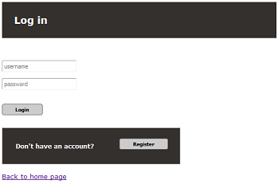
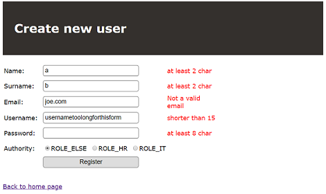
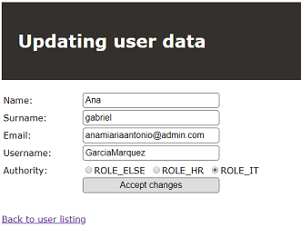

# Employee info space
This is a project I created after completing a `Spring` course, in order to somehow sum up what I have learned.

## Introduction
It is a `spring` web application. A platform where people can create/manage their own accounts.
 
 - An admin functionality is present. Admin can delete and update every account.
 - Password athentication and encryption, certain restraint to the View and access are powered by `Spring Security`.
 - Data is stored in `MySQL` database with `Hibernate's` help.

# Database
  

# Default page, listing all the users
Admin has obviously more options to perform in the system.
Standard user can only modify himself.

When searching for customers, the system is traversing whole database trying to match the search phrase to email/name/surname or username of any user.

  
  
___

  

# Login, Register

 

  
# Updating account

 On the left a situation where somebody is editing his own account, when on the right, Admin editing some user's data

   